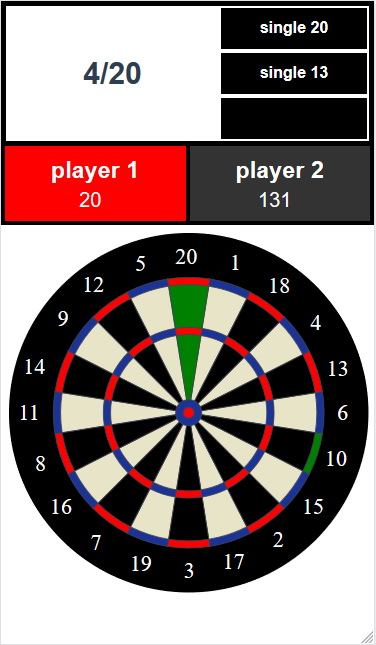

# darts-open

Keep track of darts score while playing on a traditional board.


Try it: [https://jonniek.github.io/darts/](https://jonniek.github.io/darts/)

Current game modes:
- 301, 501, 701
- shootout

Features:
- Up to 5 players
- Highscores for shootout in localStorage
- Possible to change colors of any targets(ex. 01 uses green for winning throw)

## Project setup
```
npm install
```

### Compiles and hot-reloads for development
```
npm run serve
```

### Compiles and minifies for production
```
npm run build
```

### Lints and fixes files
```
npm run lint
```
